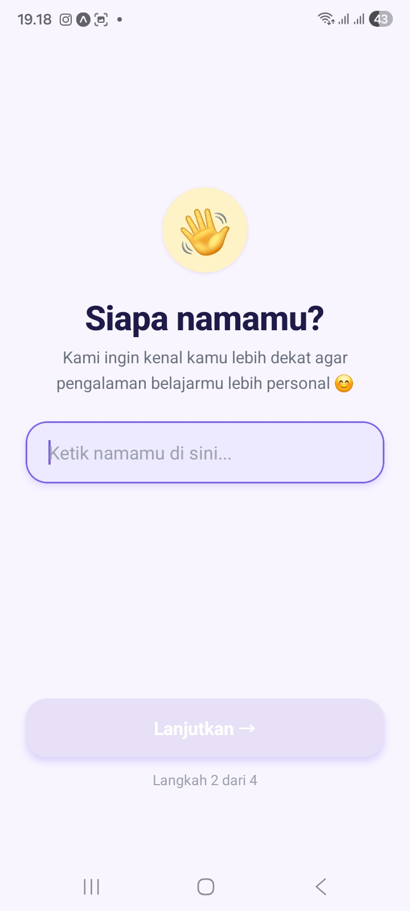
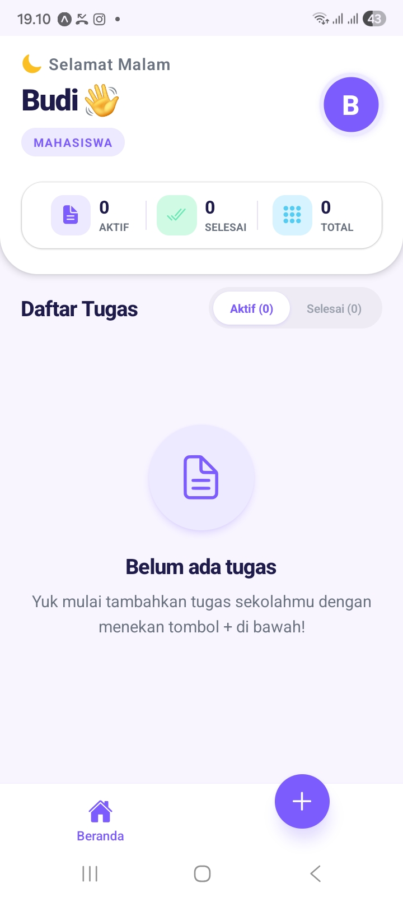

# 📝 Aplikasi To-Do List (TugasKu)

Dokumentasi ini disiapkan khusus untuk memudahkan pemahaman sistem dan fitur yang ada dalam aplikasi.

---

## 🎯 Tujuan Proyek
Aplikasi ini dirancang sebagai manajemen tugas berbasis mobile yang modern, cepat, dan mudah digunakan, lengkap dengan fitur penyimpanan lokal dan sistem *onboarding*.

---

## 📸 Tampilan & Fitur Utama

Berikut adalah visualisasi dari alur penggunaan aplikasi beserta penjelasan fungsinya:

### 1. Sistem Onboarding (Pengguna Baru)

![Tampilan Welcome Screen]

* **Layar Sapaan:** Layar pertama yang muncul saat aplikasi dibuka pertama kali oleh pengguna baru, memberikan kesan *branding* yang kuat.
* **Form Input:** Pengguna akan diminta mengisi nama dan memilih kategori tugas untuk kustomisasi Dashboard.

### 2. Dashboard Utama & Manajemen Tugas

![Tampilan Dashboard dan Tambah Tugas]

* **Daftar Tugas:** Menampilkan semua tugas yang telah dibuat. Status tugas (Selesai/Belum Selesai) terlihat jelas.
* **Tambah Tugas:** Tombol + untuk membuka form guna menambah tugas baru secara instan. Data langsung tersimpan di HP.
* **Empty State:** Jika tugas masih kosong, akan muncul ilustrasi estetik agar layar tidak terlihat blank.

---

## 📂 Penjelasan Struktur Folder & File
Proyek ini dibangun menggunakan framework **Expo (React Native)** dengan arsitektur **Expo Router** agar navigasi aplikasi berjalan mulus. Berikut adalah fungsi dari masing-masing folder dan file yang kami kembangkan:

### 1. Folder `app/` (Navigasi & Layar Utama)
Folder ini adalah inti dari aplikasi, tempat semua halaman (layar) diatur.
* **`_layout.tsx`**: File gerbang utama aplikasi. Di sini kami mengatur transisi *Splash Screen*, tema keseluruhan, dan logika pengecekan apakah user baru pertama kali membuka aplikasi atau sudah pernah login.
* **`(onboarding)/`**: Folder berisi layar perkenalan untuk pengguna baru.
  * `welcome.tsx`: Layar sapaan pertama.
  * `name.tsx`: Layar untuk meminta input nama pengguna.
  * `level.tsx`: Layar untuk memilih tingkat/kategori pendidikan pengguna.
  * `ready.tsx`: Layar konfirmasi sebelum masuk ke aplikasi utama.
  * `_layout.tsx`: Pengatur transisi khusus untuk area onboarding.
* **`(tabs)/`**: Folder berisi menu utama aplikasi yang berada di bagian bawah layar (Bottom Tabs).
  * `index.tsx`: Halaman **Dashboard/Beranda**, tempat daftar tugas (to-do list) ditampilkan.
  * `add-task.tsx`: Halaman form untuk **menambah tugas baru**.
  * `_layout.tsx`: Pengatur tampilan tab menu bawah.

### 2. Folder `components/` (Elemen Visual)
Folder ini berisi potongan-potongan desain (komponen) yang bisa dipakai berulang kali agar performa aplikasi lebih ringan.
* **`EmptyState.tsx`**: Tampilan khusus (ilustrasi/teks) yang muncul saat daftar tugas masih kosong, agar layar tidak terlihat blank.
* **`FakeSplashScreen.tsx`**: Komponen layar *loading* kustom (Splash Screen) yang estetik sebelum masuk ke dalam aplikasi.
* **`TaskCard.tsx`**: Desain kotak/kartu untuk menampilkan detail masing-masing tugas di halaman beranda.

### 3. Folder `assets/` (Media)
Tempat penyimpanan seluruh aset visual asli aplikasi, seperti gambar, logo, ikon aplikasi, dan font.

### 4. Folder `constants/` (Pengaturan Tema)
Berisi file untuk mengatur warna (*Colors*), ukuran font, dan tema aplikasi secara global. Jika ke depannya ingin mengganti warna dominan aplikasi, cukup ubah dari folder ini saja tanpa harus membongkar seluruh kode.

### 5. Folder `utils/` (Fungsi Sistem Pendukung)
Berisi file logika di belakang layar.
* **`notifications.ts`**: Skrip yang disiapkan untuk mengatur sistem notifikasi (pengingat tugas) di masa mendatang.
* *(File storage)*: Pengatur sistem simpan data secara lokal di HP pengguna.

---
